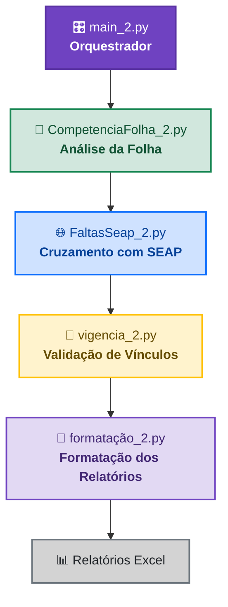
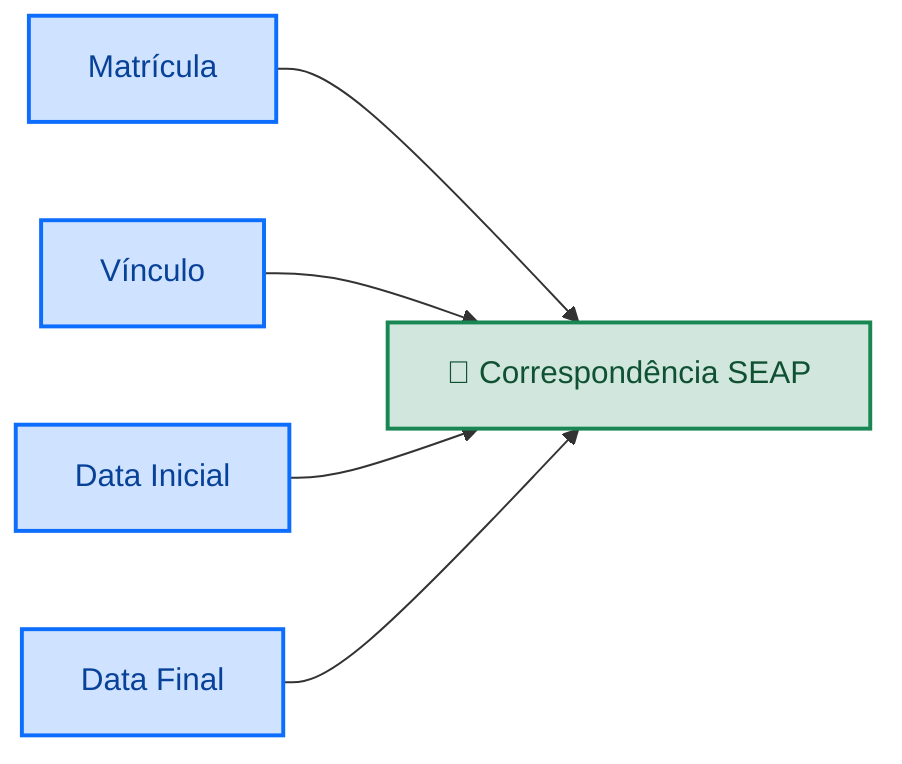
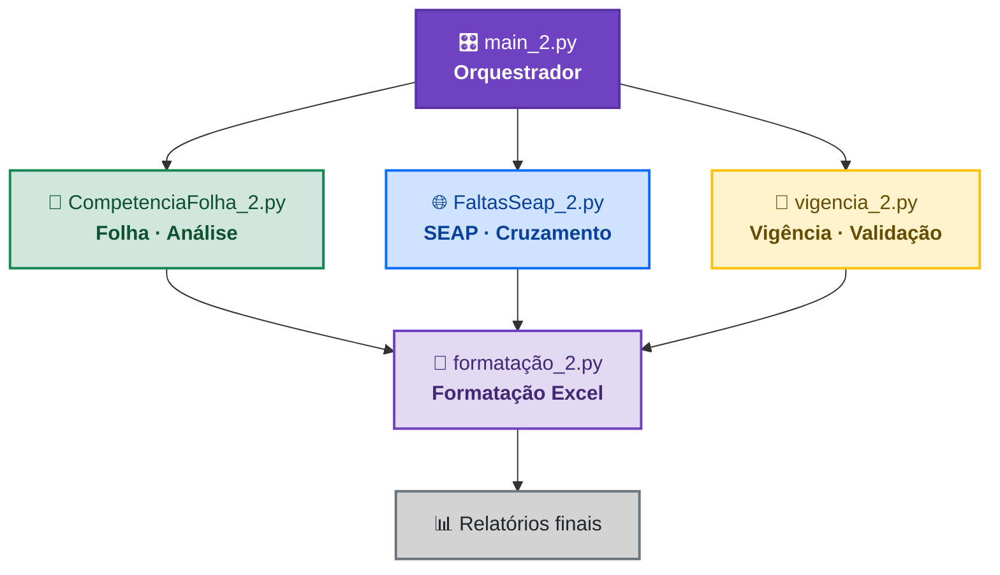
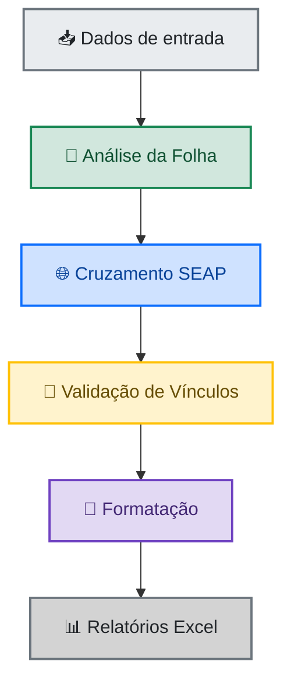

<h1 align="center">📊 Automação de Análise de Faltas</h1> <p align="center"> <strong>Pipeline automatizado para processamento, cruzamento e validação de dados</strong> <br> de faltas, folhas de pagamento e informações provenientes do SEAP. </p> <p align="center"> 🐍 Python &nbsp;•&nbsp; 📊 Pandas &nbsp;•&nbsp; 📗 OpenPyXL &nbsp;•&nbsp; 📁 Excel </p>
<h2>📌 Sobre o projeto</h2>

Este projeto automatiza o processo de análise e validação de faltas, realizando o cruzamento entre diferentes fontes de dados e gerando relatórios consolidados em Excel para conferência.

O processamento é estruturado como um pipeline de quatro etapas, executadas sequencialmente por um script responsável pela orquestração de todo o fluxo.

🎯 Objetivo: reduzir o trabalho manual de conferência, padronizar o processamento das informações e facilitar a identificação de inconsistências nos registros de faltas.

🔄 Fluxo do processamento

O projeto segue uma sequência definida de processamento:



<h2>⚙️ Etapas do Pipeline</h2>
1. 📑 Análise da Folha — CompetenciaFolha_2.py

Responsável por verificar se as faltas registradas foram devidamente descontadas na folha de pagamento.

O módulo realiza automaticamente as seguintes operações:

🔎 Localiza a planilha principal do projeto.

📂 Identifica as planilhas de folha de pagamento disponíveis.

🧾 Filtra os registros utilizando a rubrica 5040, correspondente ao desconto de faltas.

🔗 Cruza os dados das faltas com as informações da folha.

📅 Verifica se o desconto ocorreu no mesmo mês e ano da falta.

✅ Cria indicadores informando se o desconto foi localizado.

💾 Gera o arquivo FaltasFolha.xlsx.

📊 Resultado do cruzamento

O resultado da análise é representado por dois possíveis valores:

Resultado	Significado
SIM	Desconto localizado na folha
NÃO	Desconto não localizado
2. 🌐 Cruzamento SEAP — FaltasSeap_2.py

Responsável por comparar os dados internos com as informações provenientes do SEAP.

O módulo:

📂 Localiza a base principal do projeto.

📥 Consolida as planilhas de faltas exportadas do SEAP.

🔗 Realiza o cruzamento entre as duas bases.

🔐 Valida quatro critérios simultaneamente para garantir a correspondência dos registros.

✅ Cria a coluna ENCONTRADO_NO_SEAP.

💾 Gera o arquivo FaltasSEAP.xlsx.

🔐 Critérios de correspondência

Um registro somente é considerado encontrado quando todos os quatro campos são correspondentes entre as bases:

Campo	Descrição
Matrícula	Identificação do servidor
Vínculo	Vínculo funcional
Data Inicial	Início do período da falta
Data Final	Final do período da falta

### 🔐 Critérios de correspondência

Um registro somente é considerado **encontrado** quando *todos os quatro campos* são correspondentes entre as bases.



🔎 Regra de validação: a correspondência somente é confirmada quando todos os critérios são atendidos simultaneamente.

3. 🔗 Verificação de Vínculos — vigencia_2.py

Responsável pela validação cadastral dos vínculos dos servidores.

O módulo utiliza planilhas de referência para identificar quais servidores possuem vínculos atualmente vigentes.

Durante o processamento:

📚 São carregadas as informações cadastrais de referência.

🧠 É criado um dicionário em memória relacionando:

Func → Matrícula do servidor

Vinc → Vínculos vigentes

🔎 Cada registro de falta é analisado individualmente.

✅ O sistema verifica se o vínculo associado à falta continua vigente.

📝 São adicionadas as colunas:

VigenteFunc

VigenteVinc

Essa etapa permite identificar possíveis divergências entre os registros de faltas e a situação cadastral atual.

4. 🎨 Formatação dos Relatórios — formatação_2.py

Última etapa do pipeline, responsável por transformar os dados processados em relatórios Excel padronizados, organizados e visualmente mais intuitivos.

O módulo utiliza a biblioteca openpyxl para manipular e formatar os arquivos Excel.

✨ Tratamentos realizados

🧹 Seleção das colunas relevantes.

✏️ Renomeação das colunas utilizando padrões predefinidos.

↔️ Centralização e alinhamento dos dados.

📏 Ajuste automático da largura das colunas.

🦓 Efeito zebra para facilitar a leitura das linhas.

🎨 Identidade visual de acordo com o tipo de relatório.

🎨 Identidade visual
Relatório	Identidade
FaltasFolha.xlsx	🟢 Verde
FaltasSEAP.xlsx	🔵 Azul

🎨 A diferenciação visual facilita a identificação do tipo de relatório durante a conferência dos resultados.

<h2>🎛️ Orquestração</h2>

O main_2.py é o ponto de entrada principal do projeto.

Ele funciona como o controlador central do pipeline, garantindo que todas as etapas sejam executadas na ordem correta.

1️⃣  CompetenciaFolha_2.py
        ↓
2️⃣  FaltasSeap_2.py
        ↓
3️⃣  vigencia_2.py
        ↓
4️⃣  formatação_2.py


Além de controlar a ordem de execução, o orquestrador:

🧩 Centraliza a execução de todas as etapas.

🛡️ Utiliza blocos de tratamento de erros.

⏱️ Mede o tempo total de execução.

📋 Exibe informações do processamento no terminal.

🔄 Permite executar todo o pipeline a partir de um único ponto de entrada.

Dessa forma, o usuário não precisa executar cada script manualmente.

<h2>📁 Estrutura do projeto</h2>

A estrutura conceitual do projeto pode ser organizada da seguinte maneira:

```text
📦 projeto/
│
├── 📄 main_2.py
├── 📄 CompetenciaFolha_2.py
├── 📄 FaltasSeap_2.py
├── 📄 vigencia_2.py
├── 📄 formatação_2.py
│
├── 📂 dados/
│   ├── 📊 Base principal
│   ├── 📊 Folhas de pagamento
│   └── 📊 Arquivos SEAP
│
├── 📂 resultados/
│   ├── 📗 FaltasFolha.xlsx
│   └── 📘 FaltasSEAP.xlsx
│
└── 📄 README.md
```

💡 Observação: a estrutura acima representa a organização conceitual do projeto. Os diretórios podem variar de acordo com a configuração utilizada no ambiente de execução.

<h2>🚀 Execução</h2>

Com todas as dependências instaladas e os arquivos de entrada devidamente posicionados, basta executar o script principal:

python main_2.py


O pipeline será executado automaticamente na seguinte sequência:

📑 Análise da Folha
        ↓
🌐 Cruzamento SEAP
        ↓
🔗 Verificação de Vínculos
        ↓
🎨 Formatação
        ↓
📊 Relatórios finais


Ao final do processamento, o tempo total de execução será apresentado no terminal.

<h2>📤 Resultados</h2>

Ao concluir o processamento, o projeto gera relatórios Excel contendo os resultados das análises.

📗 FaltasFolha.xlsx

Resultado da análise dos descontos de faltas realizados na folha de pagamento.

📘 FaltasSEAP.xlsx

Resultado do cruzamento entre a base interna e os registros provenientes do SEAP.

Após a geração, os arquivos passam pela etapa de formatação, facilitando a leitura, conferência e análise dos resultados.

<h2>🧩 Tecnologias utilizadas</h2>
Tecnologia	Utilização
🐍 Python	Linguagem principal do projeto
📊 Pandas	Processamento e manipulação dos dados
📗 OpenPyXL	Leitura, escrita e formatação de arquivos Excel
📁 Excel (.xlsx)	Formato utilizado para entrada e saída dos dados
🏗️ Arquitetura

<h2>🏗️ Arquitetura</h2>

O projeto segue uma **arquitetura modular**, na qual cada script possui uma responsabilidade específica dentro do processo.



A separação das responsabilidades facilita a manutenção, evolução e identificação de falhas em cada etapa do processamento.
<h2>📌 Resumo</h2>

| Etapa | Arquivo | Responsabilidade |
|:---:|---|---|
| **1** | `CompetenciaFolha_2.py` | Verificação de descontos na folha |
| **2** | `FaltasSeap_2.py` | Cruzamento com dados do SEAP |
| **3** | `vigencia_2.py` | Validação de vínculos vigentes |
| **4** | `formatação_2.py` | Padronização e formatação dos relatórios |
| 🎛️ | `main_2.py` | **Orquestração de todo o pipeline** |

---

<h2>👨‍💻 Fluxo resumido</h2>


---

<h2>🎯 Objetivo</h2>

> **Automatizar e padronizar o processo de análise de faltas**, reduzindo atividades manuais, centralizando as etapas de processamento e facilitando a identificação de inconsistências entre as diferentes fontes de dados.

O pipeline foi desenvolvido para proporcionar um processo **mais organizado, rastreável e consistente**, desde a entrada dos dados até a geração dos relatórios finais.

Automatizar e padronizar o processo de análise de faltas, reduzindo atividades manuais, centralizando as etapas de processamento e facilitando a identificação de inconsistências entre as diferentes fontes de dados.

<p align="center"> <i>Desenvolvido para automatizar, padronizar e simplificar o processo de conferência.</i> </p>
